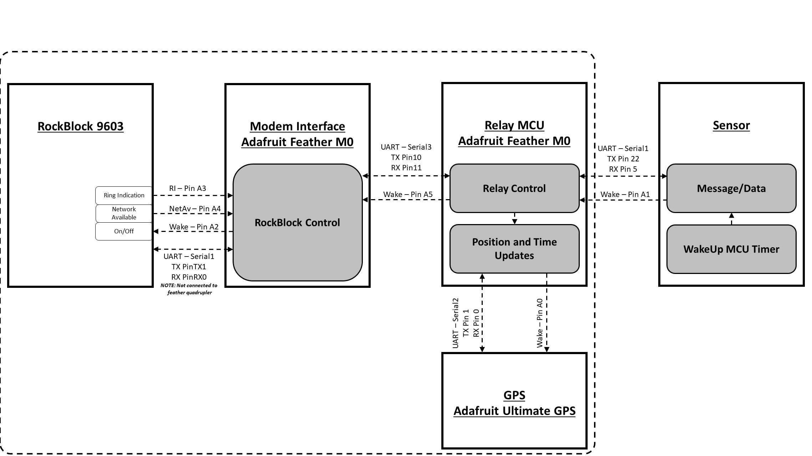
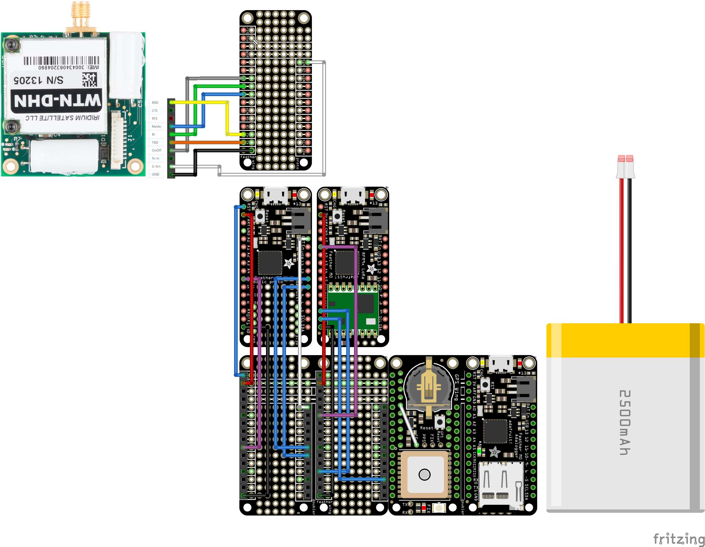

# Satellite Communication Relay

## About

A SATCOM platform for relaying messages in remote locations.  This project provides a standard interface for messages to be relayed over a Satcom link.  Initially, this is  using the RockBlock Iridium 9603 satellite modem, but the system is designed to be able to handle any other satcom system designed for small burst data transmissions.

## System Design

### Architecture Diagram

### Relay MCU

- Adafruit Feather M0 Basic [(diagram)](https://cdn-learn.adafruit.com/assets/assets/000/046/244/original/adafruit_products_Feather_M0_Basic_Proto_v2.2-1.png?1504885373)
    - The M0 was chosen as the Relay MCU because of its [6 SERCOM interfaces](https://learn.adafruit.com/using-atsamd21-sercom-to-add-more-spi-i2c-serial-ports/creating-a-new-serial).

### Iridium Modem Interface MCU
- Adafruit Feather M0 Adalogger [(diagram)](https://cdn-learn.adafruit.com/assets/assets/000/107/293/original/adafruit_products_Adafruit_Feather_M0_Adalogger_Pinout.png?1639414889)
- Firmware: https://github.com/IQTLabs/satcom-modem-interface

### Wiring Diagram

*Note on connecting AdaLogger Feather and LoRa Feather: Only pins with indicated wires should be connected to quadrupler. All others should be removed or folded out of the way.

### Arduino Setup / Flashing

1. Install Arduinu IDE
2. Install Arduino **Adafruit M0 SAMD21** Board

3. Install Arduino Libraries
    - **Adafruit GPS Library** by Adafruit
    - **IridiumSBDi2c** by SparkFun Electronics [(datasheet)](https://docs.rockblock.rock7.com/docs/connectors)
    - **ArduinoJson** by Benoit Blanchon
4. Clone / download repository, open .ino file, and flash to MCU
    - Relay MCU
        - satcom-relay.ino
        - **Adafruit Feather M0**
    - Modem Interface MCU
        - satcom-modem-interface.ino*
        - **Adafruit Feather M0 AdaLogger**

### Hardware Assembly

### Bill of Materials
| Short Name | Product Name | Price | Link |
| ---------- | ------------ | ----- | ---- |
| MCU | Feather M0 Basic Proto | $19.95 | https://www.adafruit.com/product/2772 |
| GPS | Ultimate GPS FeatherWing | $24.95 | https://www.adafruit.com/product/3133 |
| SATCOM Interface MCU | Feather M0 Adalogger | $19.95 | https://www.adafruit.com/product/2796 |
| Stacking Headers | Stacking Headers for Feather - 12-pin and 16-pin female headers | $1.25 | https://www.adafruit.com/product/2830 |
| SATCOM Modem | RockBlock 9603N | $249.95 | https://www.adafruit.com/product/4521 |
| PCB-A | Feather Quad Side-By-Side | $9.95 | https://www.adafruit.com/product/4254 |
| PCB-B | RockBlock to Feather Adapter | --- | [Design Files](./electrical/IridiumPCB) |
| Battery | Lithium Ion Battery Pack - 3.7V 6600mAh | $24.50 |  https://www.adafruit.com/product/353 |
| GPS Battery | CR1220 Coin Cell Battery | $0.95 | https://www.adafruit.com/product/380 |
| Sensor FeatherWing | FeatherWing Proto | $4.95 | https://www.adafruit.com/product/2884 |
| Micro SD Card | Micro SD Card | --- | --- |
| Dry Box Case | SE 56 Micro | $26.00 | https://evergreencases.com/ |
| Dry Box Screws | Rounded Head Thread-Forming Screws for Brittle Plastic, 18-8 Stainless Steel, Number 4 Size, 3/8" Long | --- | https://www.mcmaster.com/97349A100/ |
| 3D Printed Case Chassis | SE56-chassis.STL | --- | [SE56-chassis.STL](./hardware/SE56-chassis.STL) |
| Threaded Inserts | Tapered Heat-Set Inserts for Plastic Brass, M2.5 x 0.45 mm Thread Size, 3.4 mm Installed Length | --- | https://www.mcmaster.com/94180A321/ |
| Mounting Screws | Button Head Hex Drive Screw Passivated 18-8 Stainless Steel, M2.5 x 0.45 mm Thread, 4mm Long | --- | https://www.mcmaster.com/92095A456/ |
| Mounting Screws | Button Head Hex Drive Screw 18-8 Stainless Steel, M2.5 x 0.45 Thread Size, 20mm Long | --- | https://www.mcmaster.com/92095A115/ |

## Operations

The M0 uses SERCOM2 (RX pin 5 and TX pin 22) to listen for JSON messages from other devices. These messages then get additional keys added (`uptime_ms` and `version`) and then logged out the console.

The M0 will automatically go to sleep after `AWAKE_INTERVAL` (1 minute) if the interrupt pin (A1) hasn't been toggled. Every time the interrupt pin is toggled the `awakeTimer` is reset and the count towards `AWAKE_INTERVAL` starts over. When in sleep mode, toggling the interrupt pin will wake up the M0 again.
